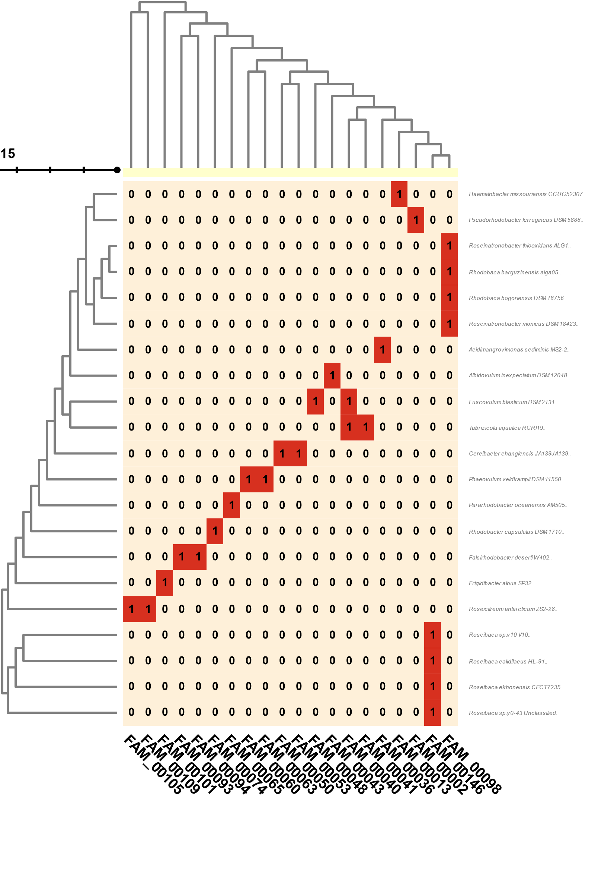
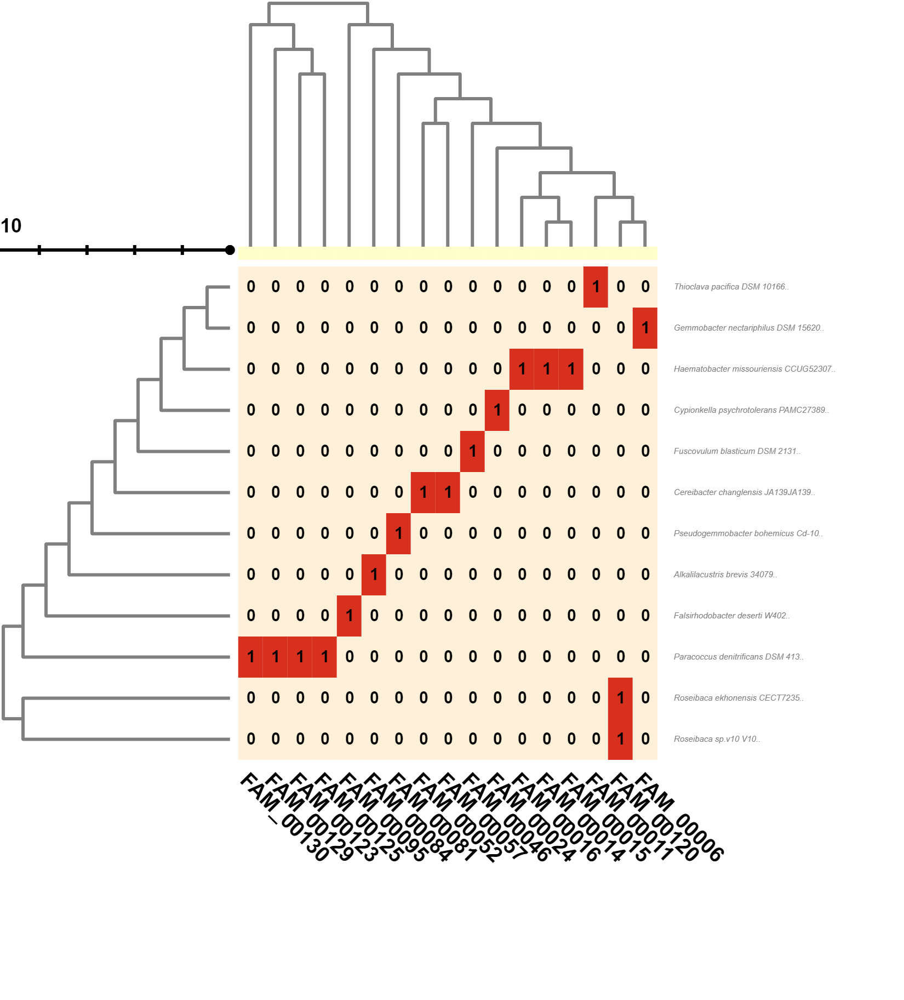
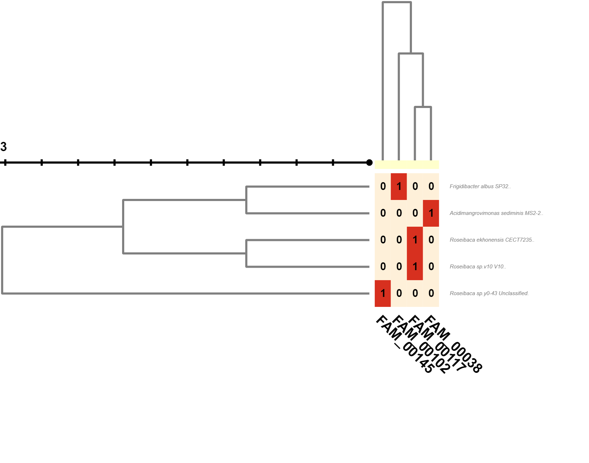
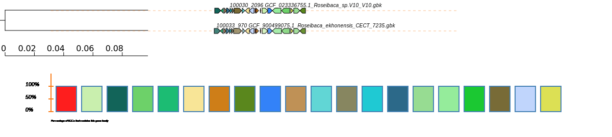

# Roseibaca

## Intro
In this repository, we conduct a study of Roseibaca V10, a strain belonging to the Rhodobacteraceae family, focusing on its evolution from a biosynthetic perspective.
The family used for this study can be seen in the file list.txt and is given by:

| Assembly accesion 	| Organims                                 	| Strain     	|
|-------------------	|------------------------------------------	|------------	|
| GCF_023336755.1   	| _Roseibaca sp.V10_                       	| V10        	|
| GCF_001517585.1   	| _Roseibaca calidilacus_                  	| HL-91      	|
| GCF_900499075.1   	| _Roseibaca ekhonensis_                   	| CECT 7235  	|
| GCF_001870675.1   	| _Roseinatronobacter thiooxidans_         	| ALG1       	|
| GCF_006716865.1   	| _Roseinatronobacter monicus_             	| DSM 18423  	|
| GCF_004366635.1   	| _Rhodobaca bogoriensis_                	| DSM 18756  	|
| GCF_001870665.2   	| _Rhodobaca barguzinensis_                	| alga05     	|
| GCF_014681765.1   	| _Roseicitreum antarcticum_               	| ZS2-28     	|
| GCF_003076755.1   	| _Pararhodobacter oceanensis_             	| AM505      	|
| GCF_003990445.1   	| _Pararhodobacter zhoushanensis_          	| ZQ420      	|
| GCF_003122215.1   	| _Pararhodobacter marinus_                	| CIC4N-9    	|
| GCF_003075525.1   	| _Pararhodobacter aggregans_              	| D1-19      	|
| GCF_016653255.1   	| _Rhodobaculum claviforme_                	| LMG 28126  	|
| GCF_003350345.1   	| _Alkalilacustris brevis_                 	| 34079      	|
| GCF_000740775.1   	| _Haematobacter missouriensis_            	| CCUG 52307 	|
| GCF_003254295.1   	| _Rhodobacter capsulatus_                 	| DSM 1710   	|
| GCF_000740785.1   	| _Paenirhodobacter enshiensis_            	| DW2-9      	|
| GCF_000714535.1   	| _Thioclava pacifica_                     	| DSM 10166  	|
| GCF_003034995.1   	| _Phaeovulum veldkampii_                 	| DSM 11550  	|
| GCF_900100045.1   	| _Paracoccus denitrificans_               	| DSM 413    	|
| GCF_009908165.1   	| _Frigidibacter albus_                    	| SP32       	|
| GCF_002927635.1   	| _Albidovulum inexpectatum_               	| DSM 12048  	|
| GCF_003034965.1   	| _Fuscovulum blasticum_                   	| DSM 2131   	|
| GCF_003290025.1   	| _Pseudogemmobacter bohemicus_            	| Cd-10      	|
| GCF_002900975.1   	| _Tabrizicola aquatica_                   	| RCRI19     	|
| GCF_001294535.1   	| _Cypionkella psychrotolerans_            	| PAMC 27389 	|
| GCF_900110025.1   	| _Gemmobacter aquatilis_                  	| DSM 3857   	|
| GCF_000420745.1   	| _Pseudorhodobacter ferrugineus_          	| DSM 5888   	|
| GCF_003034985.1   	| _Cereibacter changlensis_              	| JA139      	|
| GCF_004015795.1   	| _Falsirhodobacter deserti_               	| W402       	|
| GCF_000429765.1   	| _Gemmobacter nectariphilus_             	| DSM 15620  	|
| GCF_002871005.1   	| _Acidimangrovimonas sediminis_           	| MS2-2      	|
| GCF_004010155.1   	| _Solirhodobacter olei_                   	| Pet-1      	|

## Data Preparation
### [Download Genomes](/raw_data/)

The `.fna` files for each of the strains were downloaded from NCBI using the `ncbi-genome-download` conda environment and were stored in the [raw_data](https://github.com/shadayguerrero/Roseibaca/tree/main/raw_data).

### [Functional Annotation](https://github.com/shadayguerrero/Roseibaca/tree/main/functional_annotation) 
Functional annotation was performed with **Prokka 1.14.6**, and the details for each strain can be found in [functional_annotation](https://github.com/shadayguerrero/Roseibaca/tree/main/functional_annotation).

### [Genbank](https://github.com/shadayguerrero/Roseibaca/tree/main/gbk) 
This folder contains the `.gbk` files that resulted from the functional annotation performed with Prokka. These files were corrected using the following script,  `correctgbk.sh`, which allows us to replace the term "Unclassified" in the "Organism" field with the respective strain for each organism.

~~~
file=$1
locus=$(grep -m 1 "DEFINITION" $file |cut -d " " -f6,7) #if you have details the strain in your gbk files, use this line. Else use the next line.
#locus=$(grep -m 1 "LOCUS" $file |cut -d\  -f 8 |cut -b1-11)  #select the first 11 characters from the first "LOCUS"
perl -p -i -e 's/\n// if /ORGANISM/' $file  #cambiar 
perl -p -i -e 's/\s*Unclassified/ '"${locus}"'/' $file
~~~

Additionally, we rename the files to include the details of each organism.

~~~
cat list.txt | while read line
do 
  id2=$(echo $line |cut -d " " -f1,2,3,4,5 | tr " \t" "_")
  id=$(echo $line |cut -d " " -f1)
  #echo $id.prokka
  #echo $id2
mv $id.prokka.gbk $id2.gbk
done
~~~

## [Biosynthetic Gene Cluster (BGC) Clustering](https://github.com/shadayguerrero/Roseibaca/tree/main/antismash) 
We used **antiSMASH 6.0.0** to search for BGCs, and the results were stored in the [antismash](https://github.com/shadayguerrero/Roseibaca/tree/main/antismash) folder. Additionally, we used the [change-names.sh](/antismash/change-names.sh) script, which adds the strain details to each of the regions found by antiSMASH.

We found 7 BGCs for *Roseibaca* V10, as can be seen in the output of [antismash](/antismash/GCF_023336755.1_Roseibaca_sp.V10_V10/index.html). The relationship of these clusters with other clusters in different genomes still needs to be investigated.

## [BGC Similarity Networks](https://github.com/shadayguerrero/Roseibaca/tree/main/bigscape)
To identify the groups of BGCs that are forming and to determine in which groups Roseibaca sp.V10 is present, we used **BiG-SCAPE 1.1.2**. The results can be found in the [bigscpae/output](https://github.com/shadayguerrero/Roseibaca/tree/main/bigscape/output) folder.

A graphical exploration of the **BiG-SCAPE** results can be seen at [bigscpae/output/index.html](/bigscape/output/index.html).

### Terpene
We have the following table showing the presence and absence of genomes containing the BGC that produces **Terpene**.

 
 
In this table, we can observe the family **FAM_00127**, which includes our target genome *Roseibaca_sp.V10*. 

FAM_00127
1. GCF_001517585.1_Roseibaca_calidilacus_HL-91-NZ_FBYC01000004.region001
2. GCF_023336755.1_Roseibaca_sp.V10_V10-c00001_NZ_JALZ...region001
3. GCF_900499075.1_Roseibaca_ekhonensis_CECT_7235-NZ_UIHC01000012.region001

### RiPPs
We have the following table showing the presence and absence of genomes containing the BGC that produces **RiPPs*.*

 
 
 In this table, we can observe the family **FAM_00132**, which includes our target genome *Roseibaca_sp.V10*.

FAM_00132
1. GCF_023336755.1_Roseibaca_sp.V10_V10-c00009_NZ_JALZ...region001
2. GCF_900499075.1_Roseibaca_ekhonensis_CECT_7235-NZ_UIHC01000019.region001

### PKSother

We have the following table showing the presence and absence of genomes containing the BGC that produces Other.

we can observe the family **FAM_00128**, which includes our target genome *Roseibaca_sp.V10*.

FAM_00128
1. GCF_023336755.1_Roseibaca_sp.V10_V10-c00002_NZ_JALZ...region001
2. GCF_900499075.1_Roseibaca_ekhonensis_CECT_7235-NZ_UIHC01000006.region001

## [CORASON](https://github.com/shadayguerrero/Roseibaca/tree/main/corason/svg) 

CORASON (Clustering ORthologous proteins in Antibiotic Synthesis) is a tool specifically designed for the exploration and analysis of biosynthetic gene clusters. It allows the comparison of gene clusters across different genomes and facilitates the identification of conserved gene sets, which can provide insights into the functional and evolutionary relationships of these clusters.

By using CORASON, we aimed to identify common core genes or gene neighborhoods shared between _Roseibaca sp.V10_ and other genomes, which could indicate potential similarities in the biosynthetic capabilities or pathways. This analysis would provide a broader context for understanding the functional characteristics of _Roseibaca_ sp.V10's biosynthetic potential.

The output and results of the CORASON analysis can be found in the corresponding folder [corason/svg/](https://github.com/shadayguerrero/Roseibaca/tree/main/corason/svg) . The analysis may reveal clusters with similar core genes or shared gene neighborhoods, shedding light on the relationships and potential similarities between Roseibaca sp.V10 and other genomes in terms of biosynthetic capabilities.

### **Ectoine**

For ectoine, we used the gene  [BMJDCPAI_00849](https://github.com/shadayguerrero/Roseibaca/blob/main/corason/query/ectoine_BMJDCPAI_00849.query) as the query, and here are the results:

The CORASON analysis with the gene BMJDCPAI_00849 as the query identified several clusters in different genomes that share similarity with the ectoine biosynthetic pathway. These clusters may contain genes involved in the synthesis of ectoine or related compounds.

The analysis revealed the following clusters:

Cluster 1: GCF_001517585.1_Roseibaca_calidilacus_HL-91-NZ_FBYC01000004.region001

Genes involved in ectoine biosynthesis: BMJDCPAI_00849, BMJDCPAI_00850, BMJDCPAI_00851, BMJDCPAI_00852, BMJDCPAI_00853
Cluster 2: GCF_023336755.1_Roseibaca_sp.V10_V10-c00001_NZ_JALZ...region001

Genes involved in ectoine biosynthesis: BMJDCPAI_00849, BMJDCPAI_00850, BMJDCPAI_00851, BMJDCPAI_00852, BMJDCPAI_00853
Cluster 3: GCF_900499075.1_Roseibaca_ekhonensis_CECT_7235-NZ_UIHC01000012.region001

Genes involved in ectoine biosynthesis: BMJDCPAI_00849, BMJDCPAI_00850, BMJDCPAI_00851, BMJDCPAI_00852, BMJDCPAI_00853
These clusters indicate the presence of a conserved set of genes associated with ectoine biosynthesis in the genomes mentioned above. The shared presence of these genes suggests that these organisms may have the capability to produce ectoine or similar compounds.
### **RRE**

In addition, using RRE (Rapid Response Engine), we analyzed the gene BMJDCPAI_02120 as the target gene and identified a gene family that includes Roseibaca_v10.

The analysis with [BMJDCPAI_02120](https://github.com/shadayguerrero/Roseibaca/blob/main/corason/query/ectoine_BMJDCPAI_02120.query) revealed a gene family that is shared with _Roseibaca_ekhonensis_. This gene family may be associated with a specific biological function or metabolic pathway.

Further details and a comprehensive analysis of the gene family can be found in the RRE output files.

